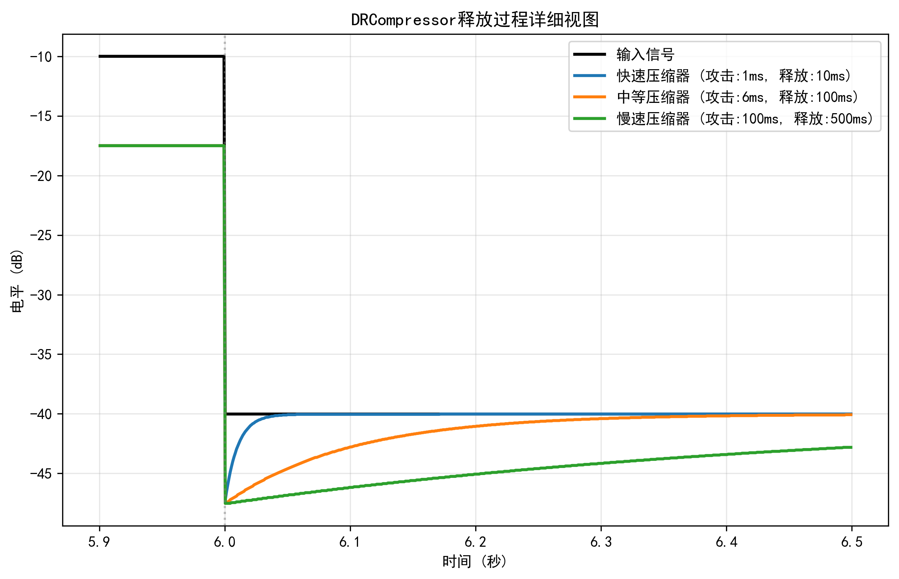

# DRCompressor类详细设计文档

## 1. 概述

DRCompressor是一个动态范围压缩器(Dynamic Range Compressor)的实现，用于音频信号处理。它通过监测输入音频信号的电平，并根据预设的参数对超过阈值的信号进行增益调整，从而控制动态范围。这种处理在音频混合、广播和录音等场景中非常有用，可以使音频的响度更加均匀，避免信号峰值过高或过低。

## 2. 类结构定义

```cpp
class DRCompressor
{
  public:
    explicit DRCompressor(float sample_rate, float threshold = -20.0f, float ratio = 2.0f, float attack = 0.006f,
                          float release = 0.1f, float knee_width = 6.0f);

    RetCode process(PCM_TYPE *buffer, unsigned int frames, unsigned int channels, float gain = 0.0);

    void reset();

  private:
    float compute_gain(float inputLevel) const;
    float sample2db(PCM_TYPE sample) const;
    float db2sample(float db) const;

  private:
    const float threshold;
    const float ratio;
    const float attack;
    const float release;
    const float knee_width;

    float current_gain;
    float attack_coeff;
    float release_coeff;

    float knee_threshold_lower;
    float knee_threshold_upper;
};
```

## 3. 参数说明

### 3.1 构造函数参数

- `sample_rate`: 采样率（Hz），用于计算时间相关系数
- `threshold`: 阈值（dB），默认值 -20.0f，信号电平超过此值时开始压缩
- `ratio`: 压缩比，默认值 2.0f，表示超过阈值的部分按照 1:ratio 的比例进行压缩
- `attack`: 起音时间（秒），默认值 0.006f，压缩器开始工作的响应时间
- `release`: 释放时间（秒），默认值 0.1f，压缩器停止工作的恢复时间
- `knee_width`: 拐点宽度（dB），默认值 6.0f，定义了压缩曲线的平滑过渡区间宽度

### 3.2 成员变量

- `threshold`, `ratio`, `attack`, `release`, `knee_width`: 存储构造函数传入的参数
- `current_gain`: 当前应用的增益值（dB）
- `attack_coeff`, `release_coeff`: 基于采样率计算的时间系数，用于平滑增益变化
- `knee_threshold_lower`, `knee_threshold_upper`: 拐点区域的下限和上限阈值

## 4. 方法详解

### 4.1 构造函数

```cpp
DRCompressor::DRCompressor(float sample_rate, float _threshold, float _ratio, float _attack, float _release,
                           float _knee_width)
    : threshold(_threshold), ratio(_ratio), attack(_attack), release(_release), knee_width(_knee_width),
      current_gain(0.0f)
{
    attack_coeff = std::exp(-1.0f / (attack * sample_rate));
    release_coeff = std::exp(-1.0f / (release * sample_rate));

    knee_threshold_lower = threshold - knee_width / 2.0f;
    knee_threshold_upper = threshold + knee_width / 2.0f;
}
```

- 初始化压缩器的基本参数
- 计算攻击和释放系数，使用指数函数实现平滑过渡
- 计算拐点阈值的上下限

### 4.2 process 方法

```cpp
RetCode DRCompressor::process(PCM_TYPE *buffer, unsigned int frames, unsigned int channels, float gain)
```

- **功能**: 处理音频数据，应用动态范围压缩
- **参数**:
  - `buffer`: 待处理的音频数据缓冲区
  - `frames`: 帧数
  - `channels`: 通道数
  - `gain`: 额外增益，默认为0.0
- **返回值**: RetCode类型，表示处理结果
- **处理流程**:
  1. 参数校验
  2. 遍历每一帧音频
  3. 找出每帧中所有通道的最大采样值
  4. 将采样值转换为dB
  5. 计算目标增益
  6. 根据攻击和释放时间平滑增益变化
  7. 应用增益到所有通道的样本
  8. 确保结果在有效范围内

### 4.3 reset 方法

```cpp
void DRCompressor::reset()
```

- **功能**: 重置压缩器状态
- **处理**: 将当前增益重置为0

### 4.4 compute_gain 方法

```cpp
float DRCompressor::compute_gain(float inputLevelDB) const
```

- **功能**: 根据输入电平计算增益调整值
- **参数**: `inputLevelDB` - 输入信号电平(dB)
- **返回值**: 计算出的增益调整值(dB)
- **处理流程**:
  1. 如果输入低于软拐点下限，不进行压缩（增益为0）
  2. 如果输入高于软拐点上限，应用完全压缩
  3. 在拐点区域内，应用平滑过渡的压缩

### 4.5 辅助转换方法

```cpp
float DRCompressor::sample2db(PCM_TYPE sample) const
float DRCompressor::db2sample(float db) const
```

- **sample2db**: 将PCM采样值转换为分贝值
- **db2sample**: 将分贝值转换为增益系数

## 5. 实现原理

### 5.1 动态范围压缩基本原理

动态范围压缩器监控输入信号的电平，当电平超过预设的阈值时，按照特定比率减小输入信号的增益。主要参数包括：

- **阈值(Threshold)**: 开始应用压缩的电平点
- **比率(Ratio)**: 输入电平变化与输出电平变化的比值
- **拐点(Knee)**: 压缩曲线的过渡区域，分为硬拐点和软拐点
- **攻击时间(Attack)**: 信号超过阈值后，压缩器开始工作所需的时间
- **释放时间(Release)**: 信号低于阈值后，压缩器停止工作所需的时间

### 5.2 软拐点实现

DRCompressor使用软拐点实现压缩，在阈值附近创建平滑过渡区域，避免突变失真：

- 拐点下限 = 阈值 - 拐点宽度/2
- 拐点上限 = 阈值 + 拐点宽度/2
- 在拐点区域内，压缩比率逐渐从1:1增加到设定比率

### 5.3 平滑控制

为了避免增益突变导致的爆音，使用攻击和释放时间参数对增益变化进行平滑：

- 使用指数平滑算法实现增益变化
- 攻击系数 = exp(-1/(攻击时间 * 采样率))
- 释放系数 = exp(-1/(释放时间 * 采样率))

## 6. 使用示例

```cpp
// 创建44.1kHz采样率、阈值-20dB、压缩比2:1的压缩器
DRCompressor compressor(44100.0f, -20.0f, 2.0f, 0.006f, 0.1f, 6.0f);

// 处理立体声音频数据
PCM_TYPE audioBuffer[1024 * 2]; // 1024帧，2通道
unsigned int frames = 1024;
unsigned int channels = 2;

// 应用压缩处理，额外增益3dB
auto result = compressor.process(audioBuffer, frames, channels, 3.0f);

// 处理完成后重置状态
compressor.reset();
```

## 7. 性能考量

- 时间复杂度: O(frames * channels)
- 空间复杂度: O(1)，仅使用少量成员变量
- 计算开销: 每帧包含对数和指数运算，在高采样率或多通道音频处理时可能占用较多CPU资源

## 8. 扩展可能性

- 添加自动增益补偿功能(Makeup Gain)
- 实现多频段压缩
- 增加旁链压缩(Sidechain)功能
- 添加预延时(Look-ahead)功能以优化瞬态处理
- 添加可视化监控接口

## 9. 代码实现分析

### 9.1 compute_gain 方法实现

```cpp
float DRCompressor::compute_gain(float inputLevelDB) const
{
    float gainReduction = 0.0f;

    if (inputLevelDB < knee_threshold_lower)
    {
        gainReduction = 0.0f;
    }
    else if (inputLevelDB > knee_threshold_upper)
    {
        gainReduction = (threshold - inputLevelDB) * (1.0f - 1.0f / ratio);
    }
    else
    {
        const float overshoot = inputLevelDB - knee_threshold_lower;
        const float compressionFactor = overshoot / (2.0f * knee_width);
        gainReduction = overshoot * compressionFactor * (1.0f - 1.0f / ratio);
    }

    return gainReduction;
}
```

这个方法实现了软拐点的压缩曲线计算，在拐点区域内平滑地应用压缩，避免了压缩过程中的突变。

### 9.2 sample2db 和 db2sample 方法

```cpp
float DRCompressor::sample2db(PCM_TYPE sample) const
{
    const float normalizedSample = std::abs(static_cast<float>(sample)) / 32768.0f;
    if (normalizedSample < 1e-6f)
    {
        return -120.0f;
    }
    return 20.0f * std::log10(normalizedSample);
}

float DRCompressor::db2sample(float db) const
{
    return std::pow(10.0f, db / 20.0f);
}
```

这两个方法提供了PCM样本值和分贝值之间的转换，在处理音频信号时非常实用。

## 10. 注意事项与最佳实践

1. 避免过度压缩，可能会导致音频失去动态特性和"呼吸"效果
2. 妥善设置攻击和释放时间，过快会导致失真，过慢会使压缩效果不明显
3. 软拐点（knee_width）参数可以平滑压缩曲线，降低压缩引入的伪影
4. 在处理高采样率或多通道音频时注意性能开销
5. 考虑在实时应用中使用更高效的实现方式

## 11. 测试与性能可视化

DRCompressor类提供了全面的测试工具和性能可视化模块，用于验证压缩器的行为并调整参数。

### 11.1 测试框架介绍

测试套件位于 `test_dr_compressor.cpp` 中，包含三个主要测试函数：

1. `test_static_characteristics()` - 测试压缩器的静态特性曲线
2. `test_dynamic_response()` - 测试压缩器对动态信号的响应
3. `test_makeup_gain()` - 测试增益调整功能

每个测试函数都会生成对应的CSV文件，然后使用 `visualize_compressor.py` 脚本将数据可视化为图表。

### 11.2 静态特性测试

静态特性测试通过向四种不同配置的压缩器输入从-60dB到0dB的信号，测量并记录其输出电平。

```cpp
void test_static_characteristics()
{
    float sample_rate = 44100.0f;
    DRCompressor comp1(sample_rate, -20.0f, 2.0f, 0.006f, 0.01f, 10.0f);  // 基础配置
    DRCompressor comp2(sample_rate, -10.0f, 2.0f, 0.006f, 0.01f, 10.0f);  // 高阈值配置
    DRCompressor comp3(sample_rate, -20.0f, 4.0f, 0.006f, 0.01f, 10.0f);  // 高压缩比配置
    DRCompressor comp4(sample_rate, -20.0f, 2.0f, 0.006f, 0.01f, 2.0f);   // 窄拐点配置
    
    // 对每种配置进行测试并记录结果
    // ...
}
```

静态特性测试生成的可视化图表显示了不同参数设置下压缩器的传输曲线和增益缩减特性：


*图 11.1: 不同配置下DRCompressor的静态特性曲线*


*图 11.2: 不同配置下DRCompressor的增益缩减曲线*

从静态特性图中可以观察到：
- 基础压缩器在-20dB阈值处开始压缩，拐点平滑
- 高阈值压缩器将压缩起点调高到-10dB
- 高压缩比压缩器在超过阈值时表现出更强的压缩效果
- 窄拐点压缩器在阈值附近表现出更陡峭的过渡区域

### 11.3 动态响应测试

动态响应测试通过向三种不同时间常数设置的压缩器输入阶跃信号，测量它们的瞬态响应特性。

```cpp
void test_dynamic_response()
{
    float sample_rate = 44100.0f;
    DRCompressor fast_comp(sample_rate, -20.0f, 4.0f, 0.001f, 0.01f, 6.0f);  // 快速响应
    DRCompressor med_comp(sample_rate, -20.0f, 4.0f, 0.006f, 0.1f, 6.0f);    // 中等响应
    DRCompressor slow_comp(sample_rate, -20.0f, 4.0f, 0.1f, 0.5f, 6.0f);     // 慢速响应
    
    // 生成测试信号并处理
    // ...
}
```

动态响应测试生成的可视化图表显示了不同时间常数设置下压缩器对阶跃信号的响应：


*图 11.3: 不同时间常数设置下DRCompressor的动态响应*

为了更清晰地观察攻击和释放过程，测试还生成了放大视图：


*图 11.4: DRCompressor攻击过程的详细视图*



*图 11.5: DRCompressor释放过程的详细视图*

从动态响应图中可以观察到：
- 快速压缩器（1ms攻击/10ms释放）几乎立即响应电平变化
- 中等压缩器（6ms攻击/100ms释放）表现出平衡的响应特性
- 慢速压缩器（100ms攻击/500ms释放）对信号变化反应较为缓慢，适合处理需要平滑过渡的素材

### 11.4 增益调整测试

增益调整测试检验了压缩器的增益补偿功能，通过向压缩器施加不同的增益值并测量输出电平变化。

```cpp
void test_makeup_gain()
{
    float sample_rate = 44100.0f;
    DRCompressor compressor(sample_rate, -20.0f, 4.0f, 1e-5f, 1e-5f, 6.0f);
    
    float input_db = -30.0f;  // 固定输入电平
    // 对不同增益值测试并记录结果
    // ...
}
```

增益调整测试生成的可视化图表显示了压缩器对不同增益值的响应：


*图 11.6: DRCompressor增益调节效果*

从增益调整图中可以观察到：
- 当输入信号低于阈值时，应用的增益与输出成线性关系
- 当增益使得信号超过阈值时，压缩开始生效，输出增长速度减缓
- 这种行为确保了即使施加较大增益，也能避免突然的电平峰值

## 12. 数学原理详解

### 12.1 压缩器的数学模型

动态范围压缩器的核心是一个非线性映射函数，它将输入信号幅度映射到输出信号幅度。这种映射在对数域（dB）中表现得更为直观。

#### 12.1.1 基本映射函数

对于给定的输入电平 $X_{dB}$，压缩器的基本映射函数（硬拐点）如下：

$$ Y_{dB} = \begin{cases}
X_{dB}, & \text{如果 } X_{dB} < T \\
T + \frac{X_{dB} - T}{R}, & \text{如果 } X_{dB} \geq T
\end{cases} $$

其中：
- $Y_{dB}$ 是输出电平 (dB)
- $X_{dB}$ 是输入电平 (dB)
- $T$ 是阈值 (dB)
- $R$ 是压缩比

这表明当信号低于阈值时，输出与输入相同；当信号高于阈值时，每超过阈值R dB，输出仅增加1 dB。

#### 12.1.2 增益计算

压缩器通常通过计算增益调整值来实现映射：

$$ G_{dB} = Y_{dB} - X_{dB} $$

对于硬拐点压缩，增益计算为：

$$ G_{dB} = \begin{cases}
0, & \text{如果 } X_{dB} < T \\
(T - X_{dB}) \cdot (1 - \frac{1}{R}), & \text{如果 } X_{dB} \geq T
\end{cases} $$

增益总是非正的，表示信号的衰减。

### 12.2 软拐点实现

硬拐点压缩在阈值处会导致增益曲线的不连续，可能引入听觉伪声。DRCompressor实现了软拐点压缩，使用平滑过渡区域。

#### 12.2.1 软拐点数学模型

软拐点区域定义为阈值 $T$ 周围的一个区间：$[T - W/2, T + W/2]$，其中 $W$ 是拐点宽度。

在软拐点区域内，增益计算采用二次曲线近似：

$$ G_{dB} = \begin{cases}
0, & \text{如果 } X_{dB} < T - W/2 \\
\frac{(X_{dB} - (T - W/2))^2}{2W} \cdot (1 - \frac{1}{R}), & \text{如果 } T - W/2 \leq X_{dB} \leq T + W/2 \\
(T - X_{dB}) \cdot (1 - \frac{1}{R}), & \text{如果 } X_{dB} > T + W/2
\end{cases} $$

在DRCompressor的实现中，中间区域的计算如下：

```cpp
const float overshoot = inputLevelDB - knee_threshold_lower;
const float compressionFactor = overshoot / (2.0f * knee_width);
gainReduction = overshoot * compressionFactor * (1.0f - 1.0f / ratio);
```

这等价于：

$$ G_{dB} = \frac{overshoot^2}{2W} \cdot (1 - \frac{1}{R}) $$

其中 $overshoot = X_{dB} - (T - W/2)$。

### 12.3 时域平滑

压缩器中的时域平滑使用一阶低通滤波器实现，其差分方程为：

$$ g[n] = \alpha \cdot g[n-1] + (1-\alpha) \cdot g_{target}[n] $$

其中：
- $g[n]$ 是当前样本的增益
- $g[n-1]$ 是前一个样本的增益
- $g_{target}[n]$ 是目标增益
- $\alpha$ 是平滑系数

#### 12.3.1 攻击和释放系数

攻击和释放系数使用时间常数计算：

$$ \alpha_{attack} = e^{-\frac{1}{F_s \cdot t_{attack}}} $$
$$ \alpha_{release} = e^{-\frac{1}{F_s \cdot t_{release}}} $$

其中：
- $F_s$ 是采样率 (Hz)
- $t_{attack}$ 是攻击时间 (秒)
- $t_{release}$ 是释放时间 (秒)

DRCompressor根据目标增益的变化方向选择使用攻击系数还是释放系数：

```cpp
if (targetGain < current_gain)
{
    current_gain = attack_coeff * current_gain + (1.0f - attack_coeff) * targetGain;
}
else
{
    current_gain = release_coeff * current_gain + (1.0f - release_coeff) * targetGain;
}
```

这确保了压缩器在响应增益降低（攻击）时快速，而在恢复（释放）时平缓。

### 12.4 dB和线性域转换

压缩器在dB域进行计算，但需要应用在线性PCM样本上。转换公式如下：

#### 12.4.1 PCM样本转dB

$$ X_{dB} = 20 \cdot \log_{10}(\frac{|X_{PCM}|}{X_{max}}) $$

其中：
- $X_{PCM}$ 是PCM样本值
- $X_{max}$ 是最大PCM值（对于16位PCM是32768）

#### 12.4.2 dB转线性增益

$$ G_{linear} = 10^{G_{dB}/20} $$

最终，线性域的样本处理为：

$$ Y_{PCM} = X_{PCM} \cdot G_{linear} $$

DRCompressor的处理核心实现为：

```cpp
auto result = static_cast<float>(buffer[i * channels + ch]) * db2sample(current_gain);
result = std::max(-32768.0f, std::min(32767.0f, result));
buffer[i * channels + ch] = static_cast<int16_t>(result);
```

### 12.5 频响与相位特性

由于DRCompressor是一个采样点级别的处理器，其频响在音频带宽内是平坦的。然而，时域平滑引入的低通特性会对不同频率的调制产生影响：

1. 攻击和释放时间决定了对信号包络变化的响应速度
2. 快速的攻击/释放时间可以响应高频调制，但可能引入失真
3. 慢速的攻击/释放时间无法追踪快速的电平变化，但能保持更自然的声音特性

低通滤波的截止频率与时间常数相关：

$$ f_c \approx \frac{1}{2 \pi \tau} $$

其中 $\tau$ 是攻击或释放时间常数。对于6ms的攻击时间，低通滤波的截止频率约为26.5Hz，这意味着DRCompressor不会响应高于此频率的电平调制。