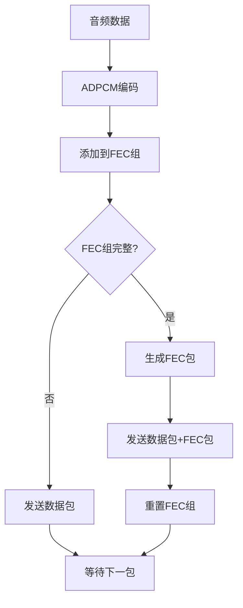
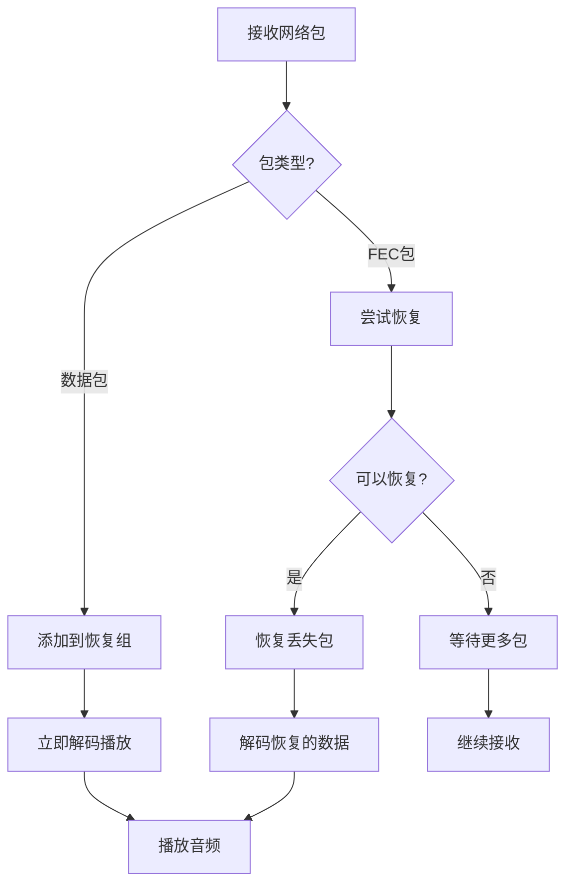

# FEC网络传输设计文档

## 概述

本文档描述了AudioDriver项目中前向错误纠正(Forward Error Correction, FEC)网络传输机制的设计与实现。FEC机制旨在提高音频数据在网络传输中的可靠性，减少包丢失对音频质量的影响。

## 设计目标

- **提高传输可靠性**：在网络包丢失情况下仍能恢复音频数据
- **低延迟**：最小化FEC引入的额外延迟
- **带宽效率**：合理的冗余开销
- **简化实现**：统一的编码和解码接口

## 架构设计

### 1. FEC分组策略

```
数据包序列：P0, P1, P2, F0, P3, P4, P5, F1, P6, P7, P8, F2, ...
            |-----------|     |-----------|     |-----------|
            Group 0 + FEC     Group 1 + FEC     Group 2 + FEC
```

- **分组大小**：3个数据包为一组 (GROUP_SIZE = 3)
- **FEC包生成**：每3个数据包生成1个FEC包
- **冗余率**：33% (1个FEC包对应3个数据包)
- **恢复能力**：每组最多可恢复1个丢失的包

### 2. 核心组件

#### 2.1 FECProcessor类

```cpp
class FECProcessor {
public:
    static constexpr size_t GROUP_SIZE = 3;
    static constexpr size_t MAX_PACKET_SIZE = NETWORK_MAX_FRAMES + 128;
    
    // 编码端接口
    bool add_packet(const uint8_t* data, size_t size, uint32_t sequence);
    bool is_complete() const;
    const uint8_t* get_fec_data() const;
    
    // 解码端接口
    bool add_received_packet(const uint8_t* data, size_t size, uint32_t sequence);
    bool add_fec_packet(const uint8_t* fec, size_t size);
    bool can_recover() const;
    bool recover_missing(uint8_t* output, size_t& size);
};
```

**设计特点**：
- 统一的类同时支持编码和解码操作
- 简化的接口减少使用复杂度
- 自动管理分组状态和序列号

#### 2.2 网络包结构

```cpp
struct DataPacket {
    uint8_t magic_num;     // 0xBD (音频) / 0xBC (FEC)
    uint8_t sender_id;     // 发送方标识
    uint8_t receiver_id;   // 接收方标识
    uint8_t is_fec;        // FEC包标识
    uint32_t sequence;     // 序列号
    uint64_t timestamp;    // 时间戳
    uint8_t channels;      // 声道数
    uint8_t sample_rate;   // 采样率
    uint8_t padding[2];    // 对齐填充
};
```

### 3. 数据流程

#### 3.1 发送端流程



**关键步骤**：
1. 音频数据经过ADPCM编码
2. 编码后的数据添加到当前FEC组
3. 立即发送原始数据包
4. 当FEC组收集满3个包时，生成并发送FEC包
5. 重置FEC组，开始下一轮

#### 3.2 接收端流程



**关键特性**：
- **零延迟播放**：接收到的数据包立即解码播放
- **后台恢复**：FEC恢复在后台进行，不影响正常播放
- **自适应分组**：根据序列号自动识别和管理FEC组

## 实现细节

### 1. XOR编码算法

FEC采用简单高效的XOR算法：

```cpp
// 编码：生成FEC数据
for (size_t i = 0; i < size; ++i) {
    fec_data[i] ^= data[i];
}

// 解码：恢复丢失数据
for (size_t i = 0; i < GROUP_SIZE; ++i) {
    if (i != missing_idx && received[i]) {
        for (size_t j = 0; j < min_size; ++j) {
            output[j] ^= packets[i][j];
        }
    }
}
```

**优势**：
- 计算复杂度低：O(n)
- 内存占用小：只需要存储XOR结果
- 实现简单：易于理解和调试

### 2. 序列号管理

```cpp
// 分组基序列号计算
uint32_t group_base = (sequence / GROUP_SIZE) * GROUP_SIZE;
uint32_t group_index = sequence - group_base;

// FEC包序列号
uint32_t fec_sequence = group_base + GROUP_SIZE;
```

### 3. 错误处理

- **包大小不一致**：同一组内所有包必须大小相同
- **序列号越界**：自动检测并重置分组
- **恢复失败**：仅在有FEC包且仅丢失1个包时才尝试恢复

## 性能特性

### 1. 延迟分析

- **编码延迟**：0ms（数据包立即发送）
- **解码延迟**：0ms（数据包立即播放）
- **恢复延迟**：取决于FEC包到达时间

### 2. 带宽开销

- **冗余率**：33%（每3个数据包对应1个FEC包）
- **包头开销**：每包16字节固定头部
- **总体开销**：约40-45%（包含包头）

### 3. 内存使用

```cpp
// 每个FECProcessor实例
static constexpr size_t MAX_PACKET_SIZE = NETWORK_MAX_FRAMES + 128;
uint8_t packets[3][MAX_PACKET_SIZE];     // ~12KB
uint8_t fec_data[MAX_PACKET_SIZE];       // ~4KB
// 总计约16KB per instance
```

## 配置参数

| 参数 | 值 | 说明 |
|------|----|----|
| GROUP_SIZE | 3 | FEC分组大小 |
| MAX_PACKET_SIZE | NETWORK_MAX_FRAMES + 128 | 最大包大小 |
| 冗余率 | 33% | 带宽开销 |
| 恢复能力 | 1/3 | 每组最多恢复1个包 |

## 使用示例

### 发送端

```cpp
// 注册发送方
netWorker.register_sender(sender_id, channels, sample_rate);

// 发送音频数据（自动处理FEC）
netWorker.send_audio(sender_id, pcm_data, frames);
```

### 接收端

```cpp
// 注册接收回调
netWorker.register_receiver(token, [](uint8_t sender, uint32_t channels, 
                                     uint32_t frames, uint32_t sample_rate,
                                     const int16_t* data, uint32_t source_ip) {
    // 处理接收到的音频数据（包括恢复的数据）
    play_audio(data, frames, channels, sample_rate);
});
```

## 优势与限制

### 优势

1. **低延迟**：不引入额外的播放延迟
2. **自动化**：无需手动管理FEC状态
3. **高效率**：XOR算法计算开销小
4. **简单性**：统一的编解码接口

### 限制

1. **恢复能力有限**：每组最多恢复1个包
2. **带宽开销**：增加33%的网络流量
3. **突发丢包**：对连续多包丢失效果有限
4. **包大小限制**：同组包必须大小相同

## 扩展方向

1. **自适应FEC**：根据网络状况动态调整冗余率
2. **Reed-Solomon码**：更强的纠错能力
3. **交错传输**：减少突发丢包影响
4. **压缩FEC**：减少FEC包大小

## 总结

当前FEC实现在简单性和效率之间取得了良好平衡，适用于中等质量网络环境下的实时音频传输。通过统一的FECProcessor类和零延迟的处理策略，为音频传输提供了可靠的错误恢复能力。